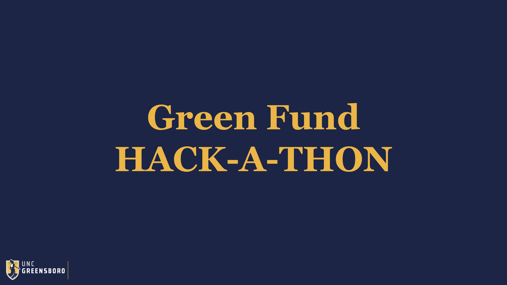

<!-- PROJECT LOGO -->
<br />
<p align="center">
  <a href="https://github.com/UNCG-CSE/Hackathon-Team8/">
    
  </a>

  <h3 align="center">Hackathon-Team8</h3>

  <p align="center">
  
  </p>
</p>

## Team Members 📣

- [**Harinderveer Badesha**](https://github.com/HarinB4)
- [**Isaac Taylor**](https://github.com/iataylor15)
- [**Nadia Doudou**](https://github.com/diatt17)
- [**Sanam Khalili**](https://github.com/SanamKhalili)
- [**Ali Altamimi**](https://github.com/CodingTheories)


**Instructor:** [**Dr. Somya Mohanty**](https://github.com/somyamohanty)

## Requirement 📜
```
pandas==1.1.4
plotly==4.12.0
dash==1.17.0
numpy==1.19.4
statsmodels==0.12.1
pytz==2020.4
matplotlib==3.3.3
scipy==1.5.4
scikit-learn==0.23.2
pip==20.2.4
Brotli==1.0.9
setuptools==49.2.1
future==0.18.2
```
## Data Source 📜
